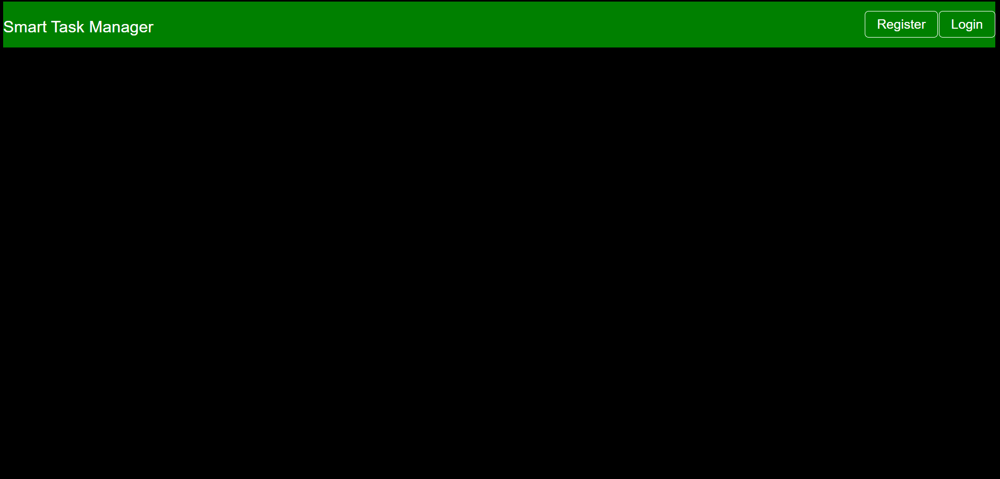
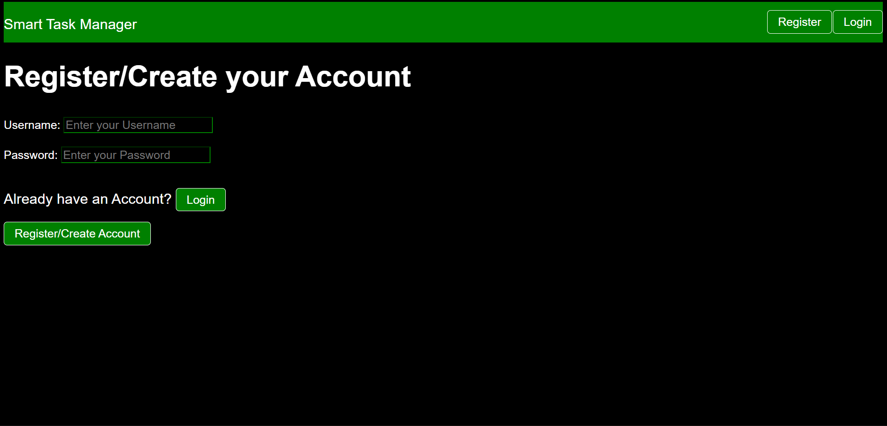
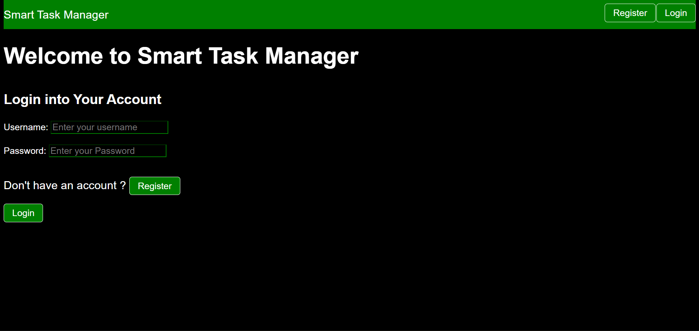
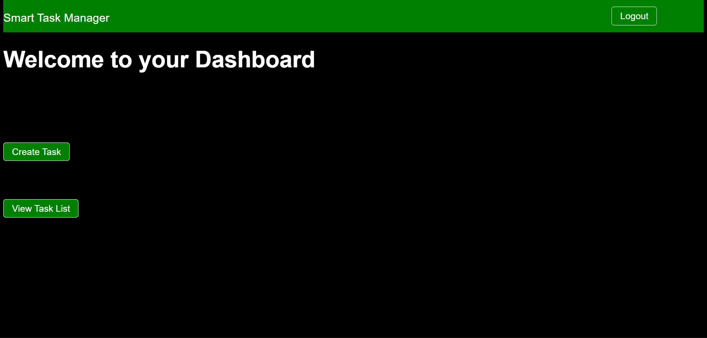
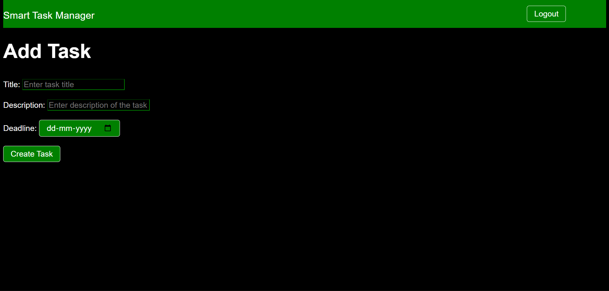
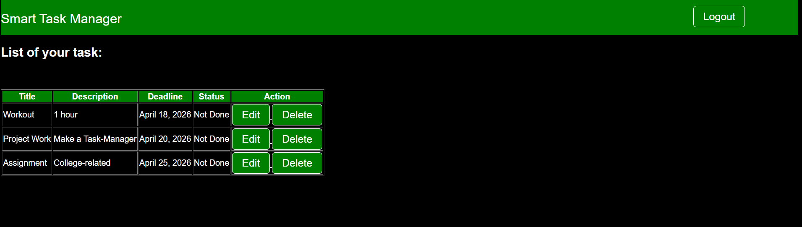
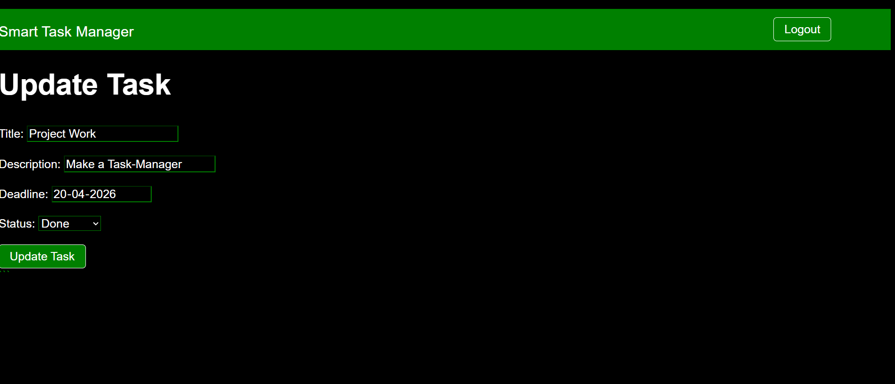

# Smart Task Manager

A simple and user-friendly Task Management Web Application built using Django.
This project allows users to manage daily tasks efficiently with authentication and CRUD operations.

---

## 🚀 Features

* User Registration and Login
* Secure Logout
* Create New Tasks
* View Personal Task List
* Update Existing Tasks
* Delete Tasks
* Mark Tasks as Complete
* User-specific task management

---

## 🛠️ Tech Stack

* Python
* Django
* HTML
* CSS
* SQLite3

---

## 📸 Screenshots

# home.html

# register.html

# login.html

# dashboard.html

# create_task.html

# list_of_task.html

# update.html

